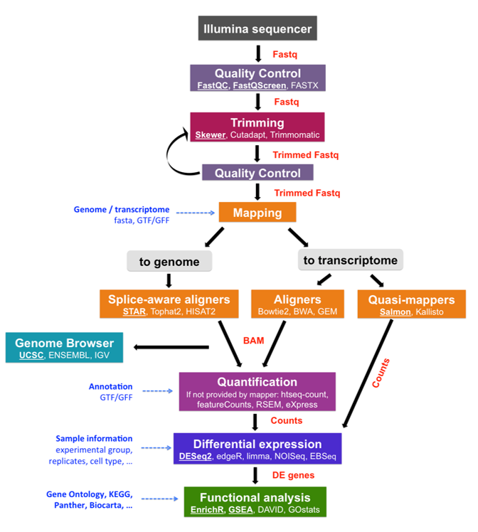

```{r setup, include = FALSE}
# Setup chunk
# Paquetes a usar
#options(htmltools.dir.version = FALSE) cambia la forma de incluir código, los colores

library(knitr)
library(tidyverse)
library(xaringanExtra)
library(icons)
library(fontawesome)
library(emo)

# set default options
opts_chunk$set(collapse = TRUE,
               dpi = 300,
               warning = FALSE,
               error = FALSE,
               comment = "#")

top_icon = function(x) {
  icons::icon_style(
    icons::fontawesome(x),
    position = "fixed", top = 10, right = 10
  )
}

knit_engines$set("yaml", "markdown")

# Con la tecla "O" permite ver todas las diapositivas
xaringanExtra::use_tile_view()
# Agrega el boton de copiar los códigos de los chunks
xaringanExtra::use_clipboard()

# Crea paneles impresionantes 
xaringanExtra::use_panelset()

# Para compartir e incrustar en otro sitio web
xaringanExtra::use_share_again()
xaringanExtra::style_share_again(
  share_buttons = c("twitter", "linkedin")
)

# Funcionalidades de los chunks, pone un triangulito junto a la línea que se señala
xaringanExtra::use_extra_styles(
  hover_code_line = TRUE,         #<<
  mute_unhighlighted_code = TRUE  #<<
)

# Agregar web cam
xaringanExtra::use_webcam()
```

```{r xaringan-editable, echo=FALSE}
# Para tener opciones para hacer editable algun chunk
xaringanExtra::use_editable(expires = 1)
# Para hacer que aparezca el lápiz y goma
xaringanExtra::use_scribble()
```


```{r xaringan-themer Eve, include=FALSE, warning=FALSE}
# Establecer colores para el tema
library(xaringanthemer)

palette <- c(
 orange        = "#fb5607",
 pink          = "#ff006e",
 blue_violet   = "#8338ec",
 zomp          = "#38A88E",
 shadow        = "#87826E",
 blue          = "#1381B0",
 yellow_orange = "#FF961C"
  )

#style_xaringan(
style_duo_accent(
  background_color = "#FFFFFF", # color del fondo
  link_color = "#562457", # color de los links
  text_bold_color = "#0072CE",
  primary_color = "#01002B", # Color 1
  secondary_color = "#CB6CE6", # Color 2
  inverse_background_color = "#00B7FF", # Color de fondo secundario 
  colors = palette,
  
  # Tipos de letra
  header_font_google = google_font("Barlow Condensed", "600"), #titulo
  text_font_google   = google_font("Work Sans", "300", "300i"), #texto
  code_font_google   = google_font("IBM Plex Mono") #codigo
  #text_font_size = "1.5rem" # Tamano de letra
)
# https://www.rdocumentation.org/packages/xaringanthemer/versions/0.3.4/topics/style_duo_accent
```

class: title-slide, middle, center
background-image: url(figures/Clases_RNASeq_Slide1.png) 
background-position: 90% 75%, 75% 75%, center
background-size: 1210px,210px, cover

.center-column[
# `r rmarkdown::metadata$title`
### `r rmarkdown::metadata$subtitle`

####`r rmarkdown::metadata$author` 
#### `r rmarkdown::metadata$date`
]

.left[.footnote[R-Ladies Theme[R-Ladies Theme](https://www.apreshill.com/project/rladies-xaringan/)]]

---
background-image: url(figures/liigh_unam_logo.png) 
background-position: 10% 10%
background-size: 10%
class: middle, center


# Sobre mi equipo
----
.left-col[ 
### `r fontawesome::fa("dna", fill = "#181818")` Sofía Salazar Magaña

Estudiante de la [Licenciatura en Ciencias Genómicas](https://www.enesjuriquilla.unam.mx/?page_id=2136) @ ENES-J UNAM

Asistente de investigación @ [RegGenoLab](https://liigh.unam.mx/), LIIGH UNAM

Asistente de investigación @ [Im Lab](https://hakyimlab.org/), The University of Chicago 


[`r fontawesome::fa("github")` GitHub: SophSM](https://github.com/SophSM)
]

.center-col[
### `r fontawesome::fa("dna", fill = "#181818")` Diego Ramirez

Estudiante de la [Licenciatura en Ciencias Genómicas](https://www.enesjuriquilla.unam.mx/?page_id=2136) @ ENES-J UNAM

]

.right-col[


]
---

class: inverse, center, middle

`r fontawesome::fa("laptop-file", height = "3em")`
# Overview de una pipeline para analisis de RNA-seq

---

## Pipeline bioinformática para RNA-seq

.pull-right[
```{r, echo=FALSE, out.width='80%', fig.align='center', fig.pos='top'}

```
]

.left[.footnote[.black[
Imagen proveniente de [mRNA-Seq data analysis workflow](https://biocorecrg.github.io/RNAseq_course_2019/workflow.html)
]]]

---

class: inverse, center, middle

`r fontawesome::fa("file-lines", height = "3em")`
# Contenido de la clase

---

### 1. Descarga de datos públicos de RNA-seq con `wget`

### 2. Análisis de control de calidad de lecturas

### 3. Trimming

### 4. Alineamiento con el genoma de referencia mediante STAR

---

class: inverse, center, middle

`r fontawesome::fa("folder-open", height = "3em")`
# 1. Descarga de datos públicos de RNA-seq

---
### ¿Cómo podemos conseguir datos públicos de RNA-seq?

La forma más simple es ir a repositorios de datos públicos, como [GEO (Gene Expression Omnibus)](https://www.ncbi.nlm.nih.gov/geo/), en donde encontraremos los archivos de datos **crudos** y a veces también las **matrices de cuentas ya procesadas** ó a [Recount3](https://rna.recount.bio/) (aquí podemos encontrar datos ya procesados).

**Para esta clase, usaremos las muestras del estudio [GSE155516](https://www.ncbi.nlm.nih.gov/geo/query/acc.cgi?acc=GSE155516)** provenientes de [Kodali, *et al*. 2021. *Mol Psychiatry*](https://www.nature.com/articles/s41380-020-00955-5).

### Descarga de los datos con `wget`

Una vez que seleccionamos el estudio que vamos a usar, entramos a la página de [ebi](https://www.ebi.ac.uk/). En el buscador, tecleamos el ID del estudio.

Seleccionamos el estudio donde dice **Nucleotide sequences**, y en la tabla inferior, en la columna **Generated FASTQ files:FTP**, seleccionamos las muestras que queremos y damos click izquierdo en donde dice **Get download script**. 

---
### Descarga de los datos con `wget`

Esto descargará un script BASH `.sh` como [este](https://github.com/EveliaCoss/RNAseq_classFEB2024/blob/main/Practica_Dia2/scripts/download.sh), el cual utilizar para descargar las muestras.

Para correr este script y descargar las muestras, debemos ir a la carpeta donde las queremos guardar y ahí guardamos el script. Supongamos que yo renombré mi script a [`download.sh`](https://github.com/EveliaCoss/RNAseq_classFEB2024/blob/main/Practica_Dia2/scripts/download.sh). Y lo tengo en una carpeta llamada `scripts`.


```{bash, eval = F}
cd /mnt/Guanina/bioinfo24/data/Clase_RNASeq2024/scripts/
chmod +x downloads.sh
./download.sh
```

Para correr el script, primero me doy permisos de ejecución con `chmod +x` y después ejecuto el script con `./`

> NOTA: Recuerda darle permisos a tu companero:

```{bash, eval=F}
setfacl -R -m u:usuario:rwx CARPETA
```

---
### Descarga de los datos con `wget`

Ya que las descargas duran mucho es conveniente mandar el script a la cola de ejecución usando un Sun Grid Engine (SGE) `.sge`. Así el script seguirá ejecutándose aunque tu no estes. 

Para lo cual hay 2 formas:
A)	Tener un solo script donde todos los datos se descargue. 
  - Ejemplo: [download_all_rawData.sge](https://github.com/EveliaCoss/RNAseq_classFEB2024/blob/main/Practica_Dia2/scripts/download_all_rawData.sge)
B)	Tener varios script y agilizar la descarga múltiple. 
  - Ejemplos: [download_control_rawData.sge](https://github.com/EveliaCoss/RNAseq_classFEB2024/blob/main/Practica_Dia2/scripts/download_control_rawData.sge),  [download_15min_rawData.sge](https://github.com/EveliaCoss/RNAseq_classFEB2024/blob/main/Practica_Dia2/scripts/download_15min_rawData.sge), [download_30min_rawData.sge](https://github.com/EveliaCoss/RNAseq_classFEB2024/blob/main/Practica_Dia2/scripts/download_30min_rawData.sge) y [download_4h_rawData.sge](https://github.com/EveliaCoss/RNAseq_classFEB2024/blob/main/Practica_Dia2/scripts/download_4h_rawData.sge).

---

## Symlink

Los datos contenido en `data/` se encuentran presentes dentro de la carpeta con ayuda de un symlink:

```{bash, eval=FALSE}
ln -s /mnt/Citosina/amedina/dramirez/clase/data/fastq/* .
```

Es una manera de trabajar con los datos sin tener que hacer copias de los mismos. No pesan, pero funcionan como los datos originales.

---

class: inverse, center, middle

`r fontawesome::fa("laptop-code", height = "3em")`
# 2. Análisis de control de calidad

---
# 1. Análisis de control de calidad de lecturas

Para hacer el análisis de control de calidad **QC**. Utilizaremos los programas `fastqc` y `multiqc`

### 1. Fastqc 

Este programa va a realizar un análisis de control de calidad en cada una de los archivos `.fastq.gz` y nos va a dar un reporte en forma de un archivo tipo `.html`. 

Para más información visita la pagina https://www.bioinformatics.babraham.ac.uk/projects/fastqc/.

### 2. Multiqc

Este programa toma todos los archivos `.html` que arrojó `fastqc` y nos dará un reporte combinado de todas las muestras.

Para más información visita la pagina https://multiqc.info/docs/getting_started/installation/

---

### Correr `fastqc`

En mi caso, debo de cargar el módulo de `fastqc` primero para poder utilizar los comandos. Si estás trabajando en tu computadora local y ya está instalado `fastqc`, tal vez esto no sea necesario.

También creamos una carpeta para los outputs de `fastqc`

```{bash, eval = F}
qlogin # pedir un nodo de prueba, default = 2GB
module load fastqc/0.11.3
module load multiqc/1.5
cd /mnt/Guanina/bioinfo24/data/Clase_RNASeq2024/
mkdir quality1
```

Después, usaremos un `for loop` para hacer `fastqc` a todos los archivos que tengan terminación `.fastq.gz`

```{bash, eval = F}
for file in data/*.fastq.gz; do fastqc $file -o quality1; done
```

El comando para correr `fastqc` en un solo archivo es:

```{bash, eval = F}
fastqc nombre.fastq.gz -o /directorio/de/salida
```

---

## Analicemos el output de `fastQC`

Veamos la informacion contenida en el [`SRR12363092_1_fastqc.html`](https://eveliacoss.github.io/RNAseq_classFEB2024/Practica_Dia2/FastQC_Reports/SRR12363092_1_fastqc.html).

---
## Pausa: Mi carpeta se ve (más o menos) así:

```{bash, eval = F}
Clase_RNASeq2024/
├── data/
│   ├── SRR12363092_1.fastq.gz
│   ├── SRR12363092_2.fastq.gz
│   ├── SRR12363093_1.fastq.gz
│   ├── SRR12363093_2.fastq.gz
...
├── quality1/
│   ├── SRR12363092_1_fastqc.html
│   ├── SRR12363092_1_fastqc.zip
│   ├── SRR12363092_2_fastqc.html
├── scripts/
...
```

Mira [aquí](https://github.com/EveliaCoss/RNASeq_Workshop_Nov2023/blob/main/Dia2_Alineamiento/out_logs/qc1.o369176) cómo se ve la ejecución de este comando.

---
### Correr `multiqc`

Multiqc reconoce los outputs de `fastqc` por lo que el comando para utilizarlo es muy sencillo

```{bash, eval = F}
multiqc quality1
```

#### **NOTA: siempre es mejor utilizar direcciones absolutas a relativas, para evitar que tus outputs se guarden en un directorio no deseado: **

```{bash, eval = F}
multiqc /mnt/Guanina/bioinfo24/data/Clase_RNASeq2024/quality1/
```

---

## Script y ejecución en el cluster

Si desean ver como se analizaron los datos empleando los programas `FastQC` y `multiQC` dentro del cluster DNA, les dejo los siguientes scripts:

  - [`qc1.sh`](https://github.com/EveliaCoss/RNAseq_classFEB2024/edit/main/Practica_Dia2/scripts/qc1.sh) 
  - [`qc1.sge`](https://github.com/EveliaCoss/RNAseq_classFEB2024/blob/main/Practica_Dia2/scripts/qc1.sge)

Mira [aquí](https://github.com/EveliaCoss/RNAseq_classFEB2024/blob/main/Practica_Dia2/out_logs/qc1.o369176) la salida del programa.

---

## Analicemos el output de `multiqc`

Veamos la informacion contenida en el [`multiqc_report.html`](https://eveliacoss.github.io/RNAseq_classFEB2024/Practica_Dia2/FastQC_Reports/multiqc_report.html).

---

class: inverse, center, middle

`r fontawesome::fa("filter", height = "3em")`
# 3. Trimming
### Remover adaptadores y secuencias de mala calidad 

---

## Trimming

Para hacer **trimming** de las lecturas que no tuvieron una buena calidad, utilizaremos la herramienta `trimmomatic`. Este programa tiene muchas opciones que nos permiten hacer trimming de formas distintas, aquí muestro el comando que utilizaremos para nuestras necesidades. Pero asegúrate de leer el [manual](http://www.usadellab.org/cms/uploads/supplementary/Trimmomatic/TrimmomaticManual_V0.32.pdf) para tus análisis personales.


**Para paired-end necesitamos:**

- Las dos lecturas paired end por muestra: `SRRxxxxx_1.fastq.gz` y `SRRxxxx_2.fastq.gz`

- Un archivo con los adaptadores que vamos a cortar: `TruSeq3-PE-2.fa`

Descarga los adaptadores de [aquí](https://github.com/timflutre/trimmomatic/blob/master/adapters/TruSeq3-PE-2.fa)

```{bash, eval = F}
wget https://raw.githubusercontent.com/timflutre/trimmomatic/master/adapters/TruSeq3-PE-2.fa
```


Trimmomatic nos dará 4 outputs: Las secuencias que quedaron sin par que eran originalmente del archivo "1": `_1_unpaired.fastq.gz`, las secuencias sin par que eran del archivo "2": `_2_unpaired.fastq.gz` y las secuencias que aun están pareadas: `_1_trimmed.fastq.gz` y `_2_trimmed.fastq.gz`.

---

## Correr Trimmomatic

Creamos una carpeta para los resultados

```{bash, eval = F}
mkdir TRIM_results
```

Usamos un `for loop` para hacer trimmomatic a cada par de lecturas `SRRxxxxx_1.fastq.gz` y `SRRxxxx_2.fastq.gz`

```{bash, eval = F}
module load trimmomatic/0.33
cd /mnt/Guanina/bioinfo24/data/Clase_RNASeq2024/data
for i in *_1.fastq.gz;
do echo
trimmomatic PE -threads 8 -phred33 $i "${i%_1.fastq.gz}_2.fastq.gz" \
/mnt/Guanina/bioinfo24/data/Clase_RNASeq2024/TRIM_results/"${i%_1.fastq.gz}_1_trimmed.fq.gz" \
/mnt/Guanina/bioinfo24/data/Clase_RNASeq2024/TRIM_results/"${i%_1.fastq.gz}_1_unpaired.fq.gz" \
/mnt/Guanina/bioinfo24/data/Clase_RNASeq2024/TRIM_results/"${i%_1.fastq.gz}_2_trimmed.fq.gz" \
/mnt/Guanina/bioinfo24/data/Clase_RNASeq2024/TRIM_results/"${i%_1.fastq.gz}_2_unpaired.fq.gz" \
ILLUMINACLIP:/mnt/Guanina/bioinfo24/data/Clase_RNASeq2024/TruSeq3-PE-2.fa:2:30:10 LEADING:3 TRAILING:3 SLIDINGWINDOW:4:20 MINLEN:80 \

done
```

---

# Documentación de las opciones

`ILLUMINACLIP:<fastaWithAdaptersEtc>:<seed mismatches>:<palindrome clip threshold>:<simple clip threshold>`

- seedMismatches: specifies the maximum mismatch count which will still allow a full match to be performed

- palindromeClipThreshold: specifies how accurate the match between the two 'adapter ligated' reads must be for PE palindrome read alignment.

- simpleClipThreshold: specifies how accurate the match between any adapter sequence must be against a read.


`SLIDINGWINDOW:<windowSize>:<requiredQuality>`

- windowSize: specifies the number of bases to average across

- requiredQuality: specifies the average quality required.

```{bash, eval= F}
ILLUMINACLIP:/mnt/Guanina/bioinfo24/data/Clase_RNASeq2024/TruSeq3-PE-2.fa:2:30:10 LEADING:3 TRAILING:3 SLIDINGWINDOW:4:20 MINLEN:80
```

---

# Documentación de las opciones

`LEADING:<quality>`

Remove low quality bases from the beginning

quality: Specifies the minimum quality required to keep a base.

`TRAILING:<quality>`

Remove low quality bases from the end.

quality: Specifies the minimum quality required to keep a base

```{bash, eval= F}
ILLUMINACLIP:/mnt/Guanina/bioinfo24/data/Clase_RNASeq2024/TruSeq3-PE-2.fa:2:30:10 LEADING:3 TRAILING:3 SLIDINGWINDOW:4:20 MINLEN:80
```

Mira [aquí](https://github.com/EveliaCoss/RNAseq_classFEB2024/blob/main/Practica_Dia2/out_logs/trim.o369193) cómo se ve la ejecución de este comando.

---

## QC del Trimming

### ¿Qué tan buena se encuentra la calidad posterior a la limpieza de adaptadores y secuencias de baja calidad?

Corramos `fastqc` y `multiqc` de nuevo

```{bash, eval = F}
mkdir quality2
for file in /mnt/Guanina/bioinfo24/data/Clase_RNASeq2024/TRIM_results/*.fq.gz; do fastqc $file -o /mnt/Guanina/bioinfo24/data/Clase_RNASeq2024/quality2; done
```

```{bash, eval = F}
multiqc /mnt/Guanina/bioinfo24/data/Clase_RNASeq2024/quality2
```

---

## Script y ejecución en el cluster

Si desean ver como se analizaron los datos empleando los programas `FastQC` y `multiQC` dentro del cluster DNA, les dejo los siguientes scripts:

  - [`qc2.sh`](https://github.com/EveliaCoss/RNAseq_classFEB2024/blob/main/Practica_Dia2/scripts/qc2.sh) 
  - [`qc2.sge`](https://github.com/EveliaCoss/RNAseq_classFEB2024/blob/main/Practica_Dia2/scripts/qc1.sge)

---

### Pausa: Mi carpeta se ve (más o menos) así:

```{bash, eval = F}
claseSTAR
├── data
│   ├── SRR12363092_1.fastq.gz
...
├── quality1
│   ├── multiqc_data
│   │   ├── multiqc_data.json
│   │   ...
│   ├── multiqc_report.html
...
├── quality2
│   ├── multiqc_data
│   │   ...
│   ├── SRR12363092_1_trimmed.fq_fastqc.html
│   ├── SRR12363092_1_unpaired.fq_fastqc.html
│   ├── SRR12363092_2_trimmed.fq_fastqc.html
...
├── TRIM_results
│   ├── SRR12363092_1_trimmed.fq.gz
│   ├── SRR12363092_1_unpaired.fq.gz
├── scripts/
```
---

### Analicemos el output del `FastQC` y `multiqc`

Veamos la información contenida en los reportes:

- `FastQC` - [SRR12363092_1_trimmed.fq_fastqc.html](https://eveliacoss.github.io/RNAseq_classFEB2024/Practica_Dia2/FastQC_Reports/SRR12363092_1_trimmed.fq_fastqc.html)

- `multiqc` - [`multiqc_report2.html`](https://eveliacoss.github.io/RNAseq_classFEB2024/Practica_Dia2/FastQC_Reports/multiqc_report2.html).

---

class: inverse, center, middle

`r fontawesome::fa("bars", height = "3em")`
# 4. Alineamiento con el genoma de referencia mediante STAR

---
# Pero antes: ¿Qué es el alineamiento?

La **alineación del genoma** es un proceso bioinformático que consiste alinear las secuencias de ADN o ARN de uno o más genomas. El objetivo principal de la alineación del genoma es identificar *regiones de similitud u homología* entre las secuencias, lo que puede proporcionar información valiosa sobre diversos procesos biológicos, como la identificación de genes, el análisis evolutivo y la anotación funcional.

.center[

]

---

## Existen Diversas formas de alinear en RNA-seq

.center[

]

.left[.footnote[.black[
[Conesa, *et al*, 2016. *Genome Biology*](https://genomebiology.biomedcentral.com/articles/10.1186/s13059-016-0881-8)
]]]

---

## 1. Alineamiento y ensamblaje de lecturas guiado por el **genoma de referencia**

.pull-left[
```{r, echo=FALSE, out.width='60%', fig.align='center'}

```
]

.pull-right[
El alineación del genoma de referencia implica mapear las lecturas de RNA-Seq en un **genoma de referencia** conocido.

- Nos permite identificar y cuantificar la expresión de **genes conocidos** y sus isoformas. Además, podemos anotar nuevos transcritos y genes.

- De preferencia contar con un archivo de anotación (GFF).

- La especie debe tener un genoma de buena calidad.

- Empleado normalmente en un organismo modelo (humano, ratón, *Arabidopsis*, etc.).
]

---

## 2. Ensamblaje de **transcriptoma guiado**

.pull-left[
```{r, echo=FALSE, out.width='60%', fig.align='center'}

```
]

.pull-right[
Las lecturas de RNA-Seq se asignan a un transcriptoma de referencia, que es una colección de transcritos. 

- Veremos expresión de **genes**, pero no isoformas.

- NO hay anotación de nuevos transcritos.

- Si no está en el archivo de anotación (tz2gene/kallisto) no lo veremos.

- Es necesario un archivo de anotación con buena calidad.
]

---

## 2. Ensamblaje de **transcriptoma guiado**

### [**Kallisto**](https://pachterlab.github.io/kallisto/manual)

.pull-left[
- Se basa en la probabilidad de asignación correcta de las lecturas a un transcrito.

- **Pseudoalineamiento**.

- Es rápido.

- Se puede ejecutar el programa desde tu computadora.

- Se basa en los grafos de Brujin Graph (T-DBG) .

- Los Nodos (v1,v2,v3) son *k-mers*.

- Omite pasos redundantes en el T-DBG.

]

.pull-right[
```{r, echo=FALSE, out.width='80%', fig.align='center'}
knitr::include_graphics("figures/alignment_kallisto.png")
```
]

Si quieren intentarlo les dejo el curso que di en 2023 - [RNAseq_classFEB2023](https://github.com/EveliaCoss/RNAseq_classFEB2023/tree/main/RNA_seq).

.right[.footnote[
[Bray, *et al*. 2016. *Nature*](https://www.nature.com/articles/nbt.3519)]]

---

## 3. Ensamblaje ***de novo***

.pull-left[
```{r, echo=FALSE, out.width='50%', fig.align='center'}
knitr::include_graphics("figures/alignment_denovo.png")
```
]

.pull-right[
Ideal para una especie con **genoma de mala calidad o sin referencia**, como **organismos NO modelos**, además de si no contamos con un archivo de anotación bueno.

- Es recomendado utilizar lecturas *Paired-end*.
]

---

# En esta clase utilizaremos el software de alineamiento **STAR**, de tipo alineamiento a **genoma de referencia**

#### Seguiremos 2 sencillos pasos

1. Indexar el genoma de referencia creando un índice de STAR

2. Alinear y contar con STAR

[Manual de STAR](https://github.com/alexdobin/STAR/blob/master/doc/STARmanual.pdf)

**STAR** nos permite, además de alinear las lecturas, hacer un conteo en el mismo paso. El paso de conteo, puede ser separado y con otras herramientas, pero en esta clase, te enseñaré la forma sencilla en la que STAR también puede contar.

> **NOTA: Para obtener la matriz de cuentas, NECESITAMOS UN ARCHIVO DE ANOTACIÓN.**

---

## ¿Qué es un archivo de anotación?

- Un **archivo de anotación GFF** (General Feature File) es un formato de archivo estándar utilizado en bioinformática para almacenar y representar información genómica y de anotación para diversas características dentro de un *genoma*, como **genes, transcritos, exones y otros elementos genómicos**.

**Utilizamos estos archivos junto al genoma de referencia para poder encontrar ubicaciones de genes, transcritos, etc.**

- Los archivos GFF pueden venir en diferentes versiones, siendo GFF3 uno de los formatos más utilizados.

Podemos encontrar estos archivos en bases de datos genómicas como GENCODE para humanos y ratones [aquí](www.gencodegenes.org)

---

## ¿Qué es indexar un genoma de referencia?

Es una forma computacional de crear una "estructura de datos" para el genoma de referencia, mediante **índices**, de tal forma que podramos **accesar a las partes del mismo** de una forma más eficiente al alinear. 

El genoma de referencia sirve como plantilla contra la cual se realizan diversos análisis genómicos, como mapeo de lecturas, llamado de variantes y cuantificación de la expresión génica. 

**La indexación mejora la velocidad y la eficiencia de estos análisis** al permitir que el software **ubique y acceda rápidamente** a partes relevantes del genoma.

---

## 1. Crear un índice de STAR

Carguemos el módulo de STAR

```{bash, eval = F}
module load star/2.7.9a
```

Creamos un directorio para guardar el indice

```{bash, eval = F}
mkdir STAR_index
```

El script para crear el indice es el siguiente:

```{bash, eval = F}
STAR --runThreadN 12 \
--runMode genomeGenerate \
--genomeDir /mnt/Guanina/bioinfo24/data/Clase_RNASeq2024/STAR_index \
--genomeFastaFiles /mnt/Archives/genome/mouse/mm10/UCSC/chromosomes-1-file/mm10.fa \
--sjdbGTFfile /mnt/Guanina/bioinfo24/data/Clase_RNASeq2024/annotation/mm10.knownGene.gtf.gz \
--sjdbOverhang 149
```

Entremos al 
[Manual de STAR](https://github.com/alexdobin/STAR/blob/master/doc/STARmanual.pdf) para entender las opciones

---

## Script y ejecución en el cluster

Si desean ver como se analizaron los datos empleando el programa `STAR` para realizar el *index del genoma* dentro del cluster DNA, les dejo los siguientes scripts:

  - [`STAR_index.sh`](https://github.com/EveliaCoss/RNAseq_classFEB2024/blob/main/Practica_Dia2/scripts/STAR_index.sh) 
  - [`index.sge`](https://github.com/EveliaCoss/RNAseq_classFEB2024/blob/main/Practica_Dia2/scripts/index.sge)


Mira [aquí](https://github.com/EveliaCoss/RNAseq_classFEB2024/blob/main/Practica_Dia2/out_logs/index.o369188) cómo se ve la ejecución de este comando.

---

## 2. Alinear y **CONTAR** con STAR

Si revisamos el [Manual de STAR](https://github.com/alexdobin/STAR/blob/master/doc/STARmanual.pdf) notarás que hay una opción para **Contar lecturas por genes** (Sección 8). Con la opción de `--quantMode`. De hecho, estas cuentas coinciden con las cuentas que nos daría `htseq-count`

```{bash, eval = F}
index=/mnt/Guanina/bioinfo24/data/Clase_RNASeq2024/STAR_index
FILES=/mnt/Guanina/bioinfo24/data/Clase_RNASeq2024/TRIM_results/*_1_trimmed.fq.gz
for f in $FILES
do
    base=$(basename $f _1_trimmed.fq.gz)
    echo $base
    STAR --runThreadN 12 --genomeDir $index --readFilesIn $f /mnt/Guanina/bioinfo24/data/Clase_RNASeq2024/TRIM_results/$base"_2_trimmed.fq.gz" \
    --outSAMtype BAM SortedByCoordinate \
    --quantMode GeneCounts \
    --readFilesCommand zcat \
    --outFileNamePrefix /mnt/Guanina/bioinfo24/data/Clase_RNASeq2024/STAR_output/$base
done
```

Mira [aquí](https://github.com/EveliaCoss/RNAseq_classFEB2024/blob/main/Practica_Dia2/out_logs/align.o369662) cómo se ve la ejecución de este comando.

---

### SCRIPTS empleados en la clase

Todos los scripts usados en esta clase están en el [GitHub](https://github.com/EveliaCoss/RNAseq_classFEB2024/tree/main/Practica_Dia2/scripts)

---

### Las carpetas contenidas por equipo deberan ser:

```{bash, eval = F}
Equipo1
├── annotation    # Archivo de anotacion del organismo (GFF)
├── data          # raw Data
├── genome        # Genoma de Referencia o symlink del genoma de referencia (opcional)
├── metadata.csv  # Metadata
├── quality1      # FastQC y multiQC de raw Data
├── quality2      # FastQC y multiQC de los datos despues del Trimming
├── results       # Resultados obtenidos de DEG
├── scripts       # Todos los scripts
├── STAR_index    # Index del genoma de referencia
├── STAR_output   # Salida de STAR, cuentas y BAM
├── TRIM_results  # Salida del Trimming
└── TruSeq3-PE-2.fa #Adaptadores PE de Illumina

```

---

class: inverse, center, middle

`r fontawesome::fa("feather", height = "3em")`
## Recordatorio: Tarea para el **Jueves 29 de Feb**
### Elegir en equipos los transcriptomas que emplearán en su proyecto.

Deben entregarme un documento con la **Descripción de los datos** por equipo al correo ecoss@liigh.unam.mx.

---

class: center, middle

`r fontawesome::fa("code", height = "3em")`
# Jueves 29 de febrero 2024  
## Importar datos en R, Normalización y Corrección por batch
## DEG con DESeq2

Gracias por tu atención, respira y coméntame tus dudas. 
