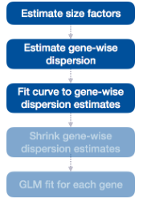
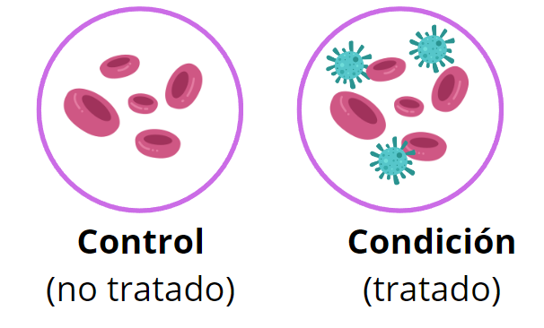

```{r setup, include = FALSE}
# Setup chunk
# Paquetes a usar
#options(htmltools.dir.version = FALSE) cambia la forma de incluir código, los colores

library(knitr)
library(tidyverse)
library(xaringanExtra)
library(icons)
library(fontawesome)
library(emo)

# set default options
opts_chunk$set(collapse = TRUE,
               dpi = 300,
               warning = FALSE,
               error = FALSE,
               comment = "#")

top_icon = function(x) {
  icons::icon_style(
    icons::fontawesome(x),
    position = "fixed", top = 10, right = 10
  )
}

knit_engines$set("yaml", "markdown")

# Con la tecla "O" permite ver todas las diapositivas
xaringanExtra::use_tile_view()
# Agrega el boton de copiar los códigos de los chunks
xaringanExtra::use_clipboard()

# Crea paneles impresionantes 
xaringanExtra::use_panelset()

# Para compartir e incrustar en otro sitio web
xaringanExtra::use_share_again()
xaringanExtra::style_share_again(
  share_buttons = c("twitter", "linkedin")
)

# Funcionalidades de los chunks, pone un triangulito junto a la línea que se señala
xaringanExtra::use_extra_styles(
  hover_code_line = TRUE,         #<<
  mute_unhighlighted_code = TRUE  #<<
)

# Agregar web cam
xaringanExtra::use_webcam()
```

```{r xaringan-editable, echo=FALSE}
# Para tener opciones para hacer editable algun chunk
xaringanExtra::use_editable(expires = 1)
# Para hacer que aparezca el lápiz y goma
xaringanExtra::use_scribble()
```


```{r xaringan-themer Eve, include=FALSE, warning=FALSE}
# Establecer colores para el tema
library(xaringanthemer)

palette <- c(
 orange        = "#fb5607",
 pink          = "#ff006e",
 blue_violet   = "#8338ec",
 zomp          = "#38A88E",
 shadow        = "#87826E",
 blue          = "#1381B0",
 yellow_orange = "#FF961C"
  )

#style_xaringan(
style_duo_accent(
  background_color = "#FFFFFF", # color del fondo
  link_color = "#562457", # color de los links
  text_bold_color = "#0072CE",
  primary_color = "#01002B", # Color 1
  secondary_color = "#CB6CE6", # Color 2
  inverse_background_color = "#00B7FF", # Color de fondo secundario 
  colors = palette,
  
  # Tipos de letra
  header_font_google = google_font("Barlow Condensed", "600"), #titulo
  text_font_google   = google_font("Work Sans", "300", "300i"), #texto
  code_font_google   = google_font("IBM Plex Mono") #codigo
  #text_font_size = "1.5rem" # Tamano de letra
)
# https://www.rdocumentation.org/packages/xaringanthemer/versions/0.3.4/topics/style_duo_accent
```

class: title-slide, middle, center
background-image: url(figures/Clases_RNASeq_Slide1.png) 
background-position: 90% 75%, 75% 75%, center
background-size: 1210px,210px, cover

.center-column[
# `r rmarkdown::metadata$title`
### `r rmarkdown::metadata$subtitle`

####`r rmarkdown::metadata$author` 
#### `r rmarkdown::metadata$date`
]

.left[.footnote[R-Ladies Theme[R-Ladies Theme](https://www.apreshill.com/project/rladies-xaringan/)]]

---

class: inverse, center, middle

`r fontawesome::fa("file-lines", height = "3em")`
# Contenido de la clase

---

### 1. Fuentes de error

### 2. Importar datos de STAR a R

### 3. Normalización de los datos

### 4. Detección y corrección por batch effect

### 5. DEG con DESeq2

---

class: inverse, center, middle

`r fontawesome::fa("bug", height = "3em")`
# 1. Fuentes de error

---

# Fuentes de error

Existen dos fuentes principales de error:

- **Error humano:** mezcla de muestras (en el laboratorio o cuando se recibieron los archivos), errores en el protocolo.

- **Error técnico:** Errores inherentes a la plataforma (e.g. secuencias de mononucleótidos en pyrosecuenciacion) –

Todas las plataformas tienen cierto de nivel de error que se debe tomar en cuenta cuando se está diseñando el experimento. 

---
# Errores en preparación de la **muestra**

- Error del usuario (e.g. etiquetar equivocadamente una muestra).

- Degradación de ADN/ARN por métodos de preservación.

- Contaminación con secuencias externas.

- Baja cantidad de ADN de inicio.

---
# Errores en preparación de las **bibliotecas**

- Error del usuario (e.g. contaminar una muestra con otra, contaminar con reacciones previas, errores en el protocolo)

- Errores de amplificación por PCR

- Sesgo por (cebadores) primers (sesgo de unión, sesgo por metilación, dímeros de cebadores [primer dimers] )

- Sesgo por captura (Poly-A, Ribozero)

- Errores de máquina (configuración errónea, interrupción de la reacción)

- Quimeras

- Errores de índice, adaptador (contaminación de adaptadores, falta de diversidad de índices, códigos (barcodes) incompatibles, sobrecargo)

---

# Errores de **secuenciación**

- Error del usuario (e.g. sobrecarga de la celda)

- Desfase (e.g. extensión incompleta, adición de múltiples nucleótidos)

- Fluoróforos muertos, nucleótidos dañados y señales superpuestas

- Contexto de la secuencia (e.g. alto contenido de GC, secuencias homologas y de baja complejidad, homopolímeros).

- Errores de máquina (e.g. laser, disco duro, programas)

- Sesgos de cadena

---
# El reto - diferenciar **señales biológicas de ruido/errores**

- Controles **negativos y positivos** - ¿Qué espero?

- **Réplicas técnicas y biológicas** - ayudan a determinar la tasa de ruido

- Conocer los tipos de errores comunes en determinada plataforma. 

---

class: inverse, center, middle

`r fontawesome::fa("terminal", height = "3em")`
# 2. Importar datos de STAR a R

---

## Recordatorio: Siempre que usen ***pseudoalineamiento*** los resultados DEBEN importarse a R usando `tximport`

.pull-left[
Los datos provenientes de:

- Salmon
- Kallisto
- RSEM

La libreria empleada en R es:

```{r, eval=FALSE}
library(tximport)
```

[Manual de tximport](https://bioconductor.org/packages/release/bioc/vignettes/tximport/inst/doc/tximport.html)

]

.pull-right[
```{r, echo=FALSE, out.width='120%', fig.align='center'}
knitr::include_graphics("figures/importacion_pseudoalineamiento.png")
```
]

---

## Archivos de salida provenientes de **STAR**

.pull-left[
Utilizaremos los archivos `SRRxxx_ReadsPerGene.out.tab`

```{bash, eval = F}
cd /mnt/Guanina/bioinfo24/data/Clase_RNASeq2024/STAR_output/
less SRR12363102_ReadsPerGene.out.tab
```

Para salir escribe `q`.

#### Información contenida

- **column 1:** gene ID

- **column 2:** counts for unstranded RNA-seq

- **column 3:** counts for the 1st read strand aligned with RNA (htseq-count option -s yes)

- **column 4:** counts for the 2nd read strand aligned with RNA (htseq-count option -s reverse)

]


.pull-right[

]


---

## Nodo de prueba en el cluster DNA

Primero cargamos a pedir un **nodo de prueba** en el cluster con `qlogin`. Default = 2GB de RAM.

Posteriormente, cargaremos el modulo de R v4.0.2.

```{bash, eval = F}
qlogin
module load r/4.0.2
R
```

---

## Pasos a seguir para el análisis de los datos de **RNA-Seq**

1. Importar datos en R (archivo de cuentas) + metadatos
2. Crear una matriz de cuentas con todos los transcriptomas
3. Crear el archivo `dds` con `DESeq2`
4. Correr el análisis de Expresión Diferencial de los Genes (DEG)
5. Normalización de los datos
6. Detección de batch effect
7. Obtener los resultados de los contraste de DEG
8. Visualización de los datos
9. Análisis de Terminos funcionales (GO terms)

---

## Pasos a seguir para el análisis de los datos de **RNA-Seq**

- Script [`load_data_inR.R`](https://github.com/EveliaCoss/RNAseq_classFEB2024/blob/main/Practica_Dia3/scripts/load_data_inR.R):

  **1)** Importar datos en R (archivo de cuentas) + metadatos y **2)** Crear una matriz de cuentas con todos los transcriptomas

- Script [`DEG_analysis.R`](https://github.com/EveliaCoss/RNAseq_classFEB2024/blob/main/Practica_Dia3/scripts/DEG_analysis.R):

  **3)** Crear el archivo `dds` con `DESeq2`, **4)** Correr el análisis de Expresión Diferencial de los Genes (DEG), **5)** Normalización de los datos, **6)** Detección de batch effect y **7)** Obtener los resultados de los contraste de DEG

- Script [`VisualizacionDatos.R`](https://github.com/EveliaCoss/RNAseq_classFEB2024/blob/main/Practica_Dia3/scripts/VisualizacionDatos.R):

  **8)** Visualización de los datos

- Script [`GOterms_analysis.R`](https://github.com/EveliaCoss/RNAseq_classFEB2024/blob/main/Practica_Dia4/scripts/GOterms_analysis.R):

  **9)** Análisis de Terminos funcionales (GO terms)

---

### Paso 1. Importar los archivos de cuentas a R

Emplearemos el script [`load_data_inR.R`](https://github.com/EveliaCoss/RNAseq_classFEB2024/blob/main/Practica_Dia2/scripts/load_data_inR.R) para correr el siguiente análisis. 

**Las siguientes lineas de commandos, están en lenguaje de R**

```{r, eval = F}
indir <- "/mnt/Guanina/bioinfo24/data/Clase_RNASeq2024/STAR_output/"
outdir <- "/mnt/Guanina/bioinfo24/data/Clase_RNASeq2024/results/"
setwd(indir)
files <- dir(pattern = "ReadsPerGene.out.tab")
```

Exploremos los datos

```{r, eval = F}
files
# [1] "SRR12363092_ReadsPerGene.out.tab" "SRR12363093_ReadsPerGene.out.tab"
# [3] "SRR12363095_ReadsPerGene.out.tab" "SRR12363096_ReadsPerGene.out.tab"
# [5] "SRR12363098_ReadsPerGene.out.tab" "SRR12363099_ReadsPerGene.out.tab"
# [7] "SRR12363101_ReadsPerGene.out.tab" "SRR12363102_ReadsPerGene.out.tab"
```

---

### Paso 2. Creamos una matriz de cuentas

Esta matriz tendrá como filas a los genes, y como columnas a las muestras.

```{r, eval = F}
seq_along(files)
# [1] 1 2 3 4 5 6 7 8
```

### Paso 3. Leer cada tabla de cuentas y extraer la segunda columna

```{r, eval = F}
counts <- c() # esta sera la matriz
for(i in seq_along(files)){
  x <- read.table(file = files[i], sep = "\t", header = F, as.is = T)
  # as.is para no convertir tipo de datos
  counts <- cbind(counts, x[,2])
}
```

---

### Paso 4. Exploremos datos

```{r, eval = F}
head(counts, 2)
#         [,1]     [,2]     [,3]     [,4]     [,5]     [,6]     [,7]     [,8]
# [1,]   342365   426305   353223   283129   346810   374542   256990   276412
# [2,]  1101670  1231975  1232813   992671  1326029  1317793  1317426  1537736
```

Observar el numero de genes (129239) (filas) y el numero de nuestras (8) (columnas).

```{r, eval = F}
dim(counts)
# [1] 129239      8
```

---

### Paso 5. Cargamos los metadatos

**¿Qué son los metadatos?**

Los metadatos nos van a dar la información acerca de las columnas / muestras de nuestros datos. Una tabla de metadatos puede tener, además, de los nombres de las muestras, información clínica, por ejemplo, **tratamiento, peso, tipo de alimentación, enfermedad (sí o no), etc.**

Estos datos son útiles para análisis posteriores, en los que queremos relacionar expresión diferencial con una condición o condiciones.

Para esta clase, solo tenemos metadatos sobre el **tipo de muestra** (CONTROL, PLS_30min, PLS_15min & PLS_4h) [Kodali, *et al*. 2021. *Mol Psychiatry*](https://www.nature.com/articles/s41380-020-00955-5).

Encuentra los metadatos [aquí](https://github.com/EveliaCoss/RNAseq_classFEB2024/blob/main/Practica_Dia2/data/metadata.csv).

```{r, eval = F}
metadata <- read.csv("/mnt/Guanina/bioinfo24/data/Clase_RNASeq2024/metadata.csv", header = F)
colnames(metadata) <- c("sample_id", "type")
head(metadata, 2)
#     sample_id    type
# 1 SRR12363092 CONTROL
# 2 SRR12363093 CONTROL
```

---

### Paso 6. Convertir a un dataframe

```{r, eval = F}
counts <- as.data.frame(counts)
```

### Paso 7. Colocar nombres de los genes en las filas

```{r, eval = F}
rownames(counts) <- x[,1] # x es el archivo original, no importa cual sea, tiene las mismas anotaciones
```

```{r, eval = F}
# for(i in seq_along(files)){
  # x <- read.table(file = files[i], sep = "\t", header = F, as.is = T)
  # counts <- cbind(counts, x[,2])
# }
```

---

### Paso 8. Colocar nombres de los transcriptomas en las columnas

```{r, eval = F}
colnames(counts) <- sub("_ReadsPerGene.out.tab", "", files)
```


```{r, eval = F}
head(counts, 2)

#                SRR12363092 SRR12363093 SRR12363095 SRR12363096 SRR12363098
# N_unmapped          342365      426305      353223      283129      346810
# N_multimapping     1101670     1231975     1232813      992671     1326029
#                SRR12363099 SRR12363101 SRR12363102
# N_unmapped          374542      256990      276412
# N_multimapping     1317793     1317426     1537736
```


### Paso 9. Guardamos

```{r, eval = F}
save(metadata, counts, file = paste0(outdir, "counts/raw_counts.RData"))
write.csv(counts, file = paste0(outdir,"counts/raw_counts.csv"))
```

---

## Descarga la matriz de cuentas 

- En formato `.csv` [aquí](https://github.com/EveliaCoss/RNAseq_classFEB2024/blob/main/Practica_Dia2/data/raw_counts.csv)

- En formato `.RData` [aquí](https://github.com/EveliaCoss/RNAseq_classFEB2024/blob/main/Practica_Dia2/data/raw_counts.RData)

El script [`load_data_inR.R`](https://github.com/EveliaCoss/RNAseq_classFEB2024/blob/main/Practica_Dia2/scripts/load_data_inR.R) se utilizo para obtener la matriz de cuentas.

---

class: inverse, center, middle

`r fontawesome::fa("laptop-code", height = "3em")`
# 3. Normalización de datos

---

## Normalización de datos
### ¿Por qué es necesario normalizar?

Nuestros datos están sujetos a **sesgos técnicos** y **biológicos** que provocan **variabilidad** en las cuentas.

Si queremos hacer **comparaciones de niveles de expresión entre muestras** es necesario *ajustar* los datos tomando en cuenta estos sesgos.

- Análisis de expresión diferencial

- Visualización de datos

En general, siempre que estemos comparando expresión entre nuestros datos.

---
.pull-left[
## Métodos de normalización

Ejemplo: **DESEq2**

```{r, echo=FALSE, out.width='120%', fig.align='center'}
knitr::include_graphics("figures/pipeline_normalizacion.png")
```

]

.pull-right[
```{r, echo=FALSE, out.width='120%', fig.align='center'}
knitr::include_graphics("figures/normalization.png")
```
]

---

## Métodos de normalización

.pull-left[

#### **Counts per million (CPM)** o **Reads per million (RPM) **  

`CPM o RPM = C * 10^6/N`

- C: Numero de reads mapeados en el gen
- N: Numero total de reads mapeados

Ejemplo: Si tenemos 5 millones de reads o lecturas (M). Y la mayoría  de ellos alinean con el genoma (4 M). Encontramos un gen con 5000 reads. 

- ¿Cuál será su valor en CPM? 

`CPM o RPM = (5000 * 10^6) / (4 * 10^6) = 1250`

]

.pull-right[

> **NOTA:** El CPM no contempla el tamaño del gen en la normalización.   

> **NOTA:** Podemos usar Z-scores, TPM, log2 Fold Change, cuentas normalizadas de DESEq2 (rlog o vst) o el método que queramos solo para la visualización de datos normalizados, pero NO para usar el resultado en el análisis de expresión diferencial (DEG).
> 
> **Para DEG solo usaremos DESEq2 y edgeR como métodos confiables en estos análisis.**
]


.left[.footnote[.black[
Para más ejemplos puedes verlos dando click [aquí](https://www.reneshbedre.com/blog/expression_units.html).
]]]

---

## **DESeq2** emplea `size factor` (median of ratios) para normalizar las raw counts

.pull-left[
Cuando se emplea la funcion `DESeq` internamente estan realizandose los siguientes procesos para **cada gen**:

```{r, eval=FALSE}
dds <- estimateSizeFactors(dds)
dds <- estimateDispersions(dds)
dds <- nbinomWaldTest(dds)
```

[Manual de DESeq2](https://www.bioconductor.org/packages/release/bioc/vignettes/DESeq2/inst/doc/DESeq2.html#control-features-for-estimating-size-factors)
]

.pull-right[
```{r, echo=FALSE, out.width='60%', fig.align='center'}

```
]

.left[.footnote[.black[
Para más ejemplos puedes verlos dando click [aquí](https://hbctraining.github.io/DGE_workshop_salmon_online/lessons/04b_DGE_DESeq2_analysis.html).
]]]

---

class: inverse, center, middle

`r fontawesome::fa("terminal", height = "3em")`
# 4. Detección y corrección por batch effect

---

# Recordatorio: Corrección por Batch effect

Buen diseño experimental con un minimo de 2 Réplicas biológicas, pero aún puede haber variación técnica.

```{r, echo=FALSE, out.width='60%', fig.align='center'}
knitr::include_graphics("figures/batch_effect_pca2.png")
```

.left[.footnote[.black[
Imagen proveniente de [Hicks, et al. 2015. bioRxiv](https://www.biorxiv.org/content/early/2015/08/25/025528)
]]]

---

## Paquetes para Corrección por Batch effect

Algunos ejemplos:

- funcion [ComBat](https://www.rdocumentation.org/packages/sva/versions/3.20.0/topics/ComBat) del paquete [SVA](https://www.bioconductor.org/packages/release/bioc/html/sva.html)

- funcion [removeBatchEffect](https://web.mit.edu/~r/current/arch/i386_linux26/lib/R/library/limma/html/removeBatchEffect.html) del paquete [limma](https://bioconductor.org/packages/release/bioc/html/limma.html)

- Paquete [batchman](https://cran.r-project.org/web/packages/batchtma/vignettes/batchtma.html)

.left[.footnote[.black[
Para más ejemplos puedes verlos dando click [aquí](https://evayiwenwang.github.io/Managing_batch_effects/adjust.html#correcting-for-batch-effects).
]]]

---

# Detección de batch effect

## Análisis de Componentes Principales (PCA)

.pull-left[

Es una herramienta para el *análisis exploratorio* de los datos que permite visualizar la **variación presente de un set de datos** con muchas **variables**.

En X es la mayor proporción de la varianza.
En Y la menor variabilidad.

**Cada dimensión o componente principal** generado por PCA será una **combinación lineal de las variables originales.**

PCA **reduce la dimensionalidad** pero **NO reduce el número de variables en los datos**.

Para más información visita [Managing batch effects](https://evayiwenwang.github.io/Managing_batch_effects/detect.html).
]

.pull-right[
```{r, echo=FALSE, out.width='60%', fig.align='center'}
knitr::include_graphics("figures/pca_example.png")
```
]

---

## Ejemplo: PCA + densidad

.pull-left[

```{r, eval=F}
library(cowplot)
library(dplyr)
library(ggplot2)
```

Codigo proveniente de [Stackoverflow](https://stackoverflow.com/questions/73554215/how-to-add-density-plot-per-component-in-pca-plot-in-r).
]


.pull-right[
```{r, echo=FALSE, out.width='100%', fig.align='center'}
knitr::include_graphics("figures/pca_example2.png")
```
]

---
class: inverse, center, middle

`r fontawesome::fa("laptop-code", height = "3em")`
# 5. DEG con DESeq2

---

## El analisis de expresion diferencial se realiza en pares

.pull-left[
Siempre vamos a comparar al **CONTROL (no tratado)** VS una **Condición (tratado)**. Las comparaciones se realizan en pares.

El diseño que debemos darle a DESeq2 seria:

```{r, eval=FALSE}
dds <- DESeqDataSetFromMatrix(countData =  counts, 
            colData = metadata, design = ~type)

levels(metadata$design)
# 	CONTROL PLS_15min PLS_30min 	PLS_4h
```

Designando que la referencia (ref) es el control.

```{r, eval=FALSE}
dds$type <- relevel(dds$type, ref = "CONTROL") 
```

]

.pull-right[
```{r, echo=FALSE, out.width='100%', fig.align='center'}

```
]

---

## Manejo de Contrastes (Contrasts)

```{r, eval=F}
levels(dds$type)
## [1] "Untreated"     "Dexamethasone"
```

Podemos renombrar contrastes

```{r, eval=FALSE}
levels(dds$type) <- c("untrt", "trt")
```

https://master.bioconductor.org/packages/release/workflows/vignettes/rnaseqGene/inst/doc/rnaseqGene.html#time-course-experiments

---

## Analisis de expresion diferencial

```{r, eval=F}
dds <- DESeq(dds)

# estimating size factors
# estimating dispersions
# gene-wise dispersion estimates
# mean-dispersion relationship
# final dispersion estimates
# fitting model and testing
```

---

## Obtener informacion de los contrastes

```{r, eval=F}
# Opcion A
results(dds, name = "type_PLS_15min_vs_CONTROL")

# Opcion B
# results(dds, contrast = c("condition", "treated", "untreated"))
results(dds, contrast = c("type", "PLS_15min", "CONTROL"))
```

---

## Podemos unir información de las variables para crear una nueva categoria

En el siguiente ejemplo utilizamos datos de LUPUS, en donde tenemos 3 variables de interes: 

- `Group`: son las condiciones (control, paciente).

- `Dose_category`: Dosis de corticoides solo en los pacientes.

- `SLEDAI_category`: Actividad de la enfermedad

```{r, eval=F}
dds <- DESeqDataSetFromTximport(txi = txi,
                                colData = metadata,
                                design = ~ Group + Dose_category + SLEDAI_category)
dds
```

Podemos crear una categoria que combine la informacion en las variables:

```{r, eval=F}
dds$Internal <- factor(paste(dds$SLEDAI_category, dds$Group, sep="_"))
```

---
class: inverse, center, middle

`r fontawesome::fa("laptop-code", height = "3em")`
# Buenas prácticas de programación
## Documentación de codigo

---
 
## Buenas prácticas de programación: Set up de tu trabajo 📌

Es buena idea comenzar **todos** tus scripts con las mismas líneas de código que indiquen lo siguiente:

.content-box-gray[
- *Título de tu programa*
- *Autor (author)*: Su nombre
- *Fecha (date)*: Fecha de creación
- *Propósito general de tu programa (Description)*: ¿Para qué sirve el programa? Ej: El siguiente programa realiza la suma de dos numeros enteros a partir de la entrada del usuario y posteriormente la imprime en pantalla.
- *Usage* ¿Cómo se utiliza?
- *Paquetes (packages)*
- *Directorio de trabajo (Working directory)*: En que carpeta se encuentra tu datos y programa.
  - *Directorio de input*: aquí estan guardados los datos que vas a usar en el programa
  - *Directorio de output*: aquí es donde vas a guardar tus resultados
- *Argumentos (Arguments)*
  - *Información de entrada (Data Inputs)*: Ej: Solo numeros enteros (sin decimales).
  - *Información de salida (Outpus)*: Graficas, figuras, tablas, etc.
- Líneas en donde cargues los datos que vas a usar
]

Ejemplo de Bonita documentación de codigo da click [aqui](https://github.com/mdozmorov/dcaf/tree/master/ngs.rna-seq)

---
class: center, middle

`r fontawesome::fa("code", height = "3em")`
# Viernes 1 de marzo 2024  
## GSEA - Análisis funcional

Gracias por tu atención, respira y coméntame tus dudas. 