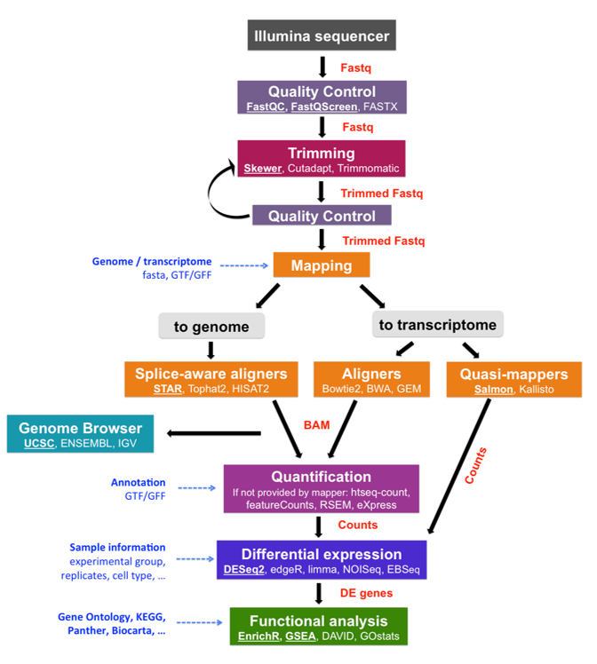
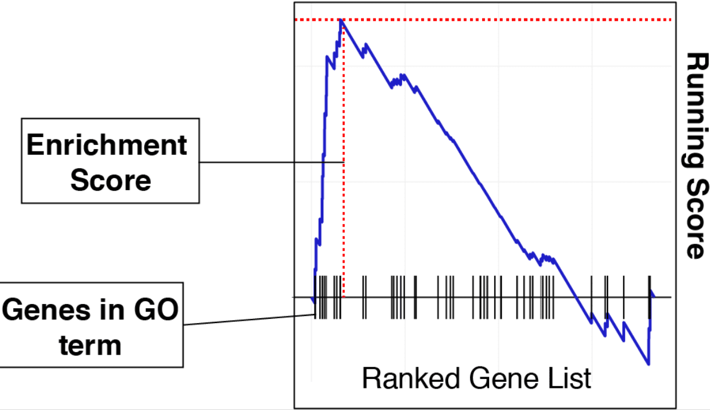
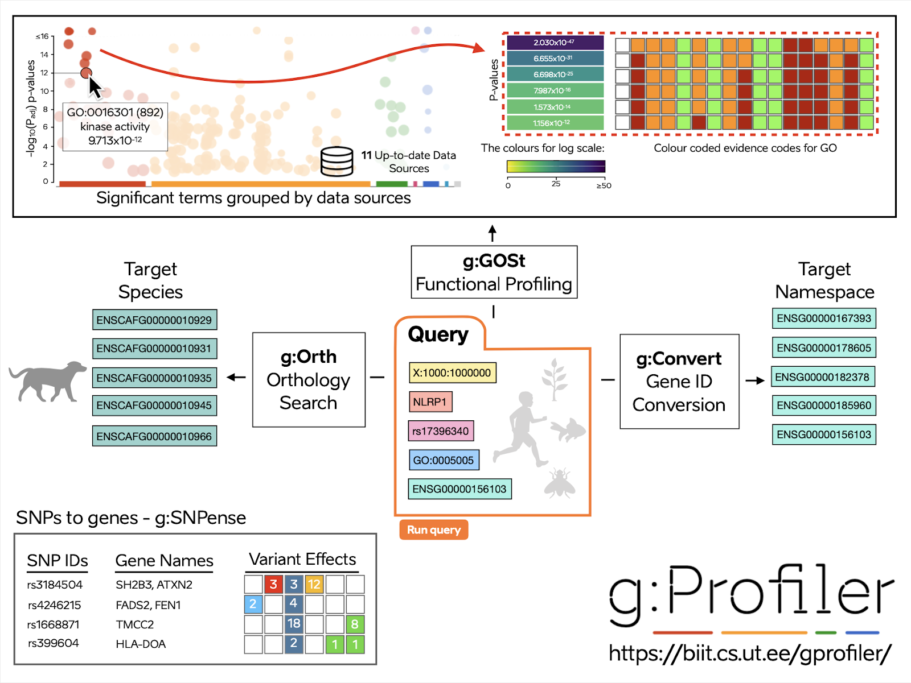
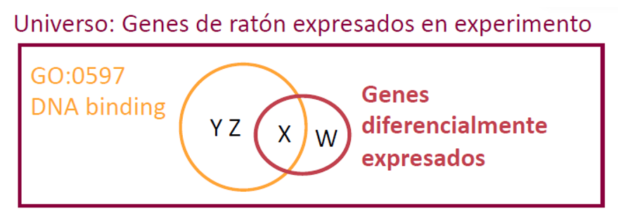
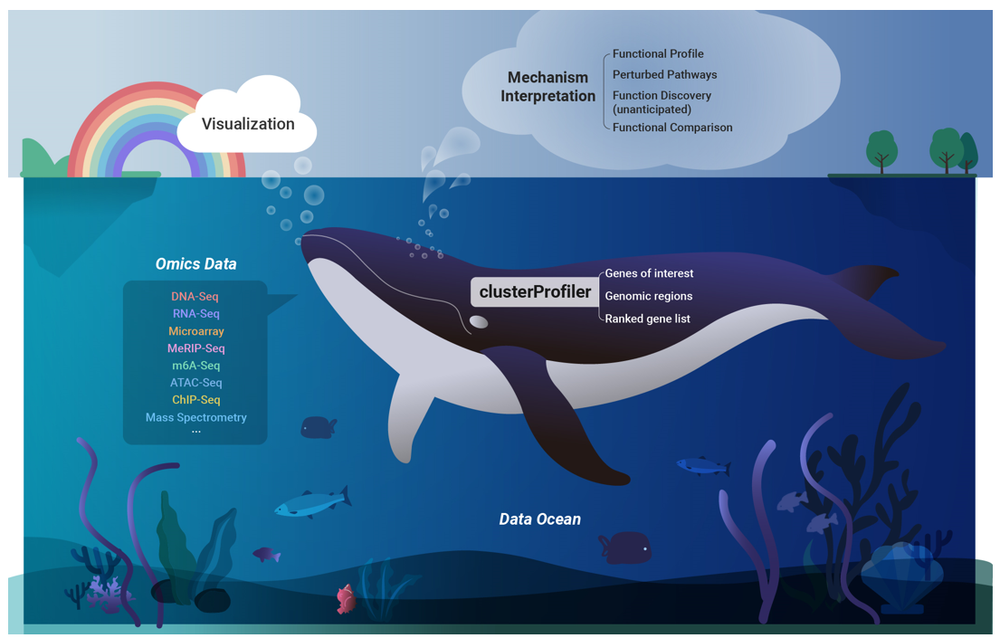
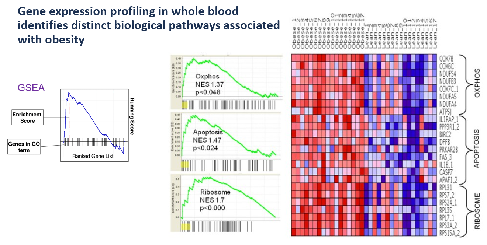
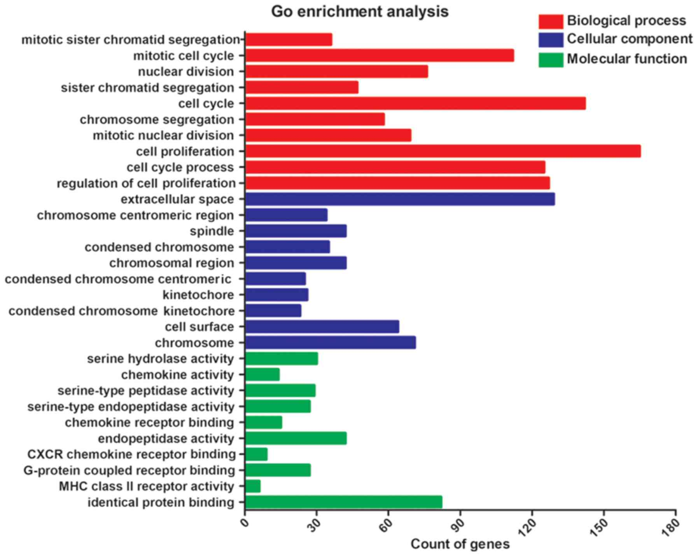
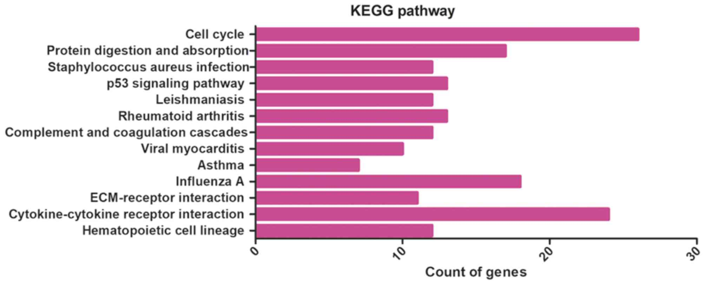
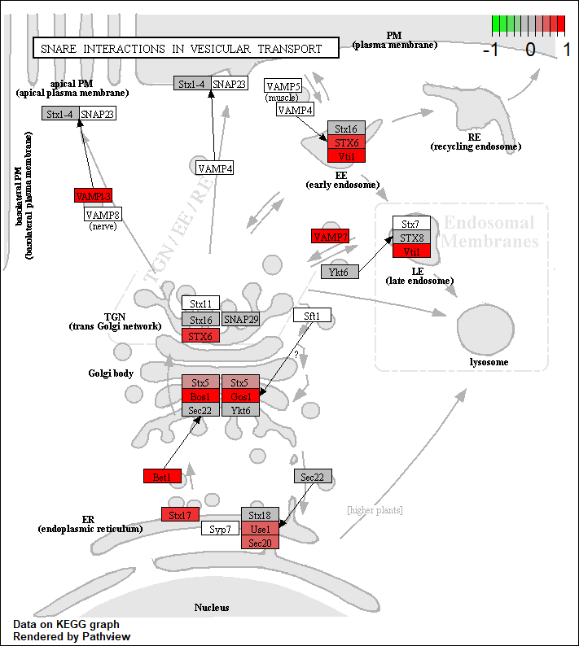
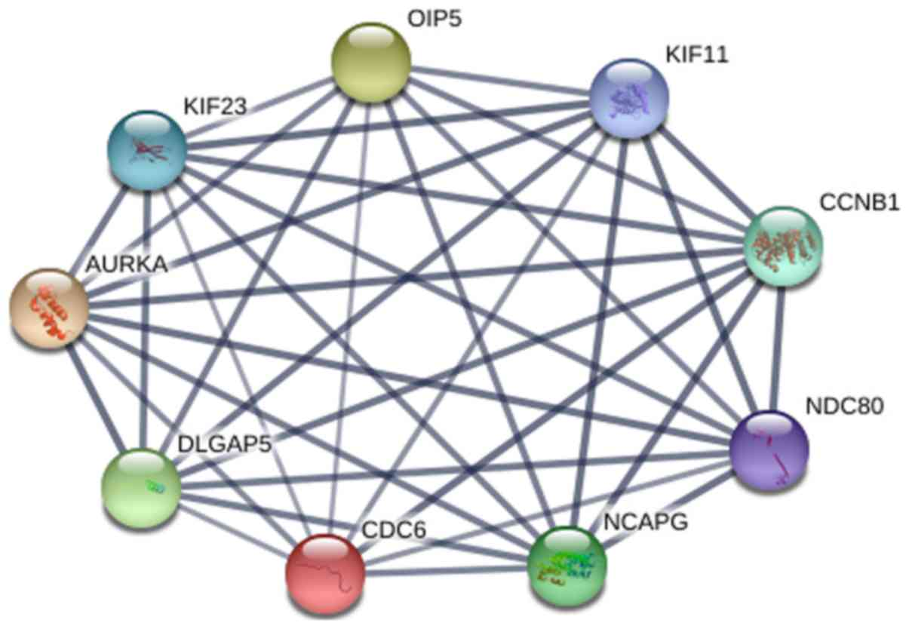

```{r setup, include = FALSE}
# Setup chunk
# Paquetes a usar
#options(htmltools.dir.version = FALSE) cambia la forma de incluir código, los colores

library(knitr)
library(tidyverse)
library(xaringanExtra)
library(icons)
library(fontawesome)
library(emo)

# set default options
opts_chunk$set(collapse = TRUE,
               dpi = 300,
               warning = FALSE,
               error = FALSE,
               comment = "#")

top_icon = function(x) {
  icons::icon_style(
    icons::fontawesome(x),
    position = "fixed", top = 10, right = 10
  )
}

knit_engines$set("yaml", "markdown")

# Con la tecla "O" permite ver todas las diapositivas
xaringanExtra::use_tile_view()
# Agrega el boton de copiar los códigos de los chunks
xaringanExtra::use_clipboard()

# Crea paneles impresionantes 
xaringanExtra::use_panelset()

# Para compartir e incrustar en otro sitio web
xaringanExtra::use_share_again()
xaringanExtra::style_share_again(
  share_buttons = c("twitter", "linkedin")
)

# Funcionalidades de los chunks, pone un triangulito junto a la línea que se señala
xaringanExtra::use_extra_styles(
  hover_code_line = TRUE,         #<<
  mute_unhighlighted_code = TRUE  #<<
)

# Agregar web cam
xaringanExtra::use_webcam()
```

```{r xaringan-editable, echo=FALSE}
# Para tener opciones para hacer editable algun chunk
xaringanExtra::use_editable(expires = 1)
# Para hacer que aparezca el lápiz y goma
xaringanExtra::use_scribble()
```


```{r xaringan-themer Eve, include=FALSE, warning=FALSE}
# Establecer colores para el tema
library(xaringanthemer)

palette <- c(
 orange        = "#fb5607",
 pink          = "#ff006e",
 blue_violet   = "#8338ec",
 zomp          = "#38A88E",
 shadow        = "#87826E",
 blue          = "#1381B0",
 yellow_orange = "#FF961C"
  )

#style_xaringan(
style_duo_accent(
  background_color = "#FFFFFF", # color del fondo
  link_color = "#562457", # color de los links
  text_bold_color = "#0072CE",
  primary_color = "#01002B", # Color 1
  secondary_color = "#CB6CE6", # Color 2
  inverse_background_color = "#00B7FF", # Color de fondo secundario 
  colors = palette,
  
  # Tipos de letra
  header_font_google = google_font("Barlow Condensed", "600"), #titulo
  text_font_google   = google_font("Work Sans", "300", "300i"), #texto
  code_font_google   = google_font("IBM Plex Mono") #codigo
  #text_font_size = "1.5rem" # Tamano de letra
)
# https://www.rdocumentation.org/packages/xaringanthemer/versions/0.3.4/topics/style_duo_accent
```

class: title-slide, middle, center
background-image: url(figures/Clases_RNASeq_Slide1.png) 
background-position: 90% 75%, 75% 75%, center
background-size: 1210px,210px, cover

.center-column[
# `r rmarkdown::metadata$title`
### `r rmarkdown::metadata$subtitle`

####`r rmarkdown::metadata$author` 
#### `r rmarkdown::metadata$date`
]

.left[.footnote[R-Ladies Theme[R-Ladies Theme](https://www.apreshill.com/project/rladies-xaringan/)]]

---

class: inverse, center, middle

`r fontawesome::fa("file-lines", height = "3em")`
# Contenido de la clase

---

### 1. Gene Set Enrichment Analysis (GSEA) - Análisis funcional

### 2. Ejemplos de graficas

### 3. Ultima Practica

---

## Pipeline bioinformática para RNA-seq

.pull-right[
```{r, echo=FALSE, out.width='80%', fig.align='center', fig.pos='top'}

```
]

.left[.footnote[.black[
Imagen proveniente de [mRNA-Seq data analysis workflow](https://biocorecrg.github.io/RNAseq_course_2019/workflow.html)
]]]

---

class: inverse, center, middle

`r fontawesome::fa("sitemap", height = "3em")`
# 1. Gene Set Enrichment Analysis (GSEA) - Análisis funcional

---

# Gene Set Enrichment Analysis (GSEA) - Análisis funcional

**Análisis de funcional de genes expresados o  diferencialmente expresados**

.pull-left[
- Comparación con una distribución hipergeométrica.

- [Ejemplo con m&ms](https://www.youtube.com/watch?v=udyAvvaMjfM)

```{r, echo=FALSE, out.width='40%', fig.align='center'}
knitr::include_graphics("figures/m&ms.jpg")
```

]

.pull-right[

```{r, echo=FALSE, out.width='100%', fig.align='center'}

```

]

.left[.footnote[.black[
Para más información visita [Bioinformatics Breakdown](https://bioinformaticsbreakdown.com/how-to-gsea/).
]]]

---

```{r, echo=FALSE, out.width='80%', fig.align='center'}

```

.left[.footnote[.black[
Imagen tomada de [Galaxy Europe](https://usegalaxy-eu.github.io/posts/2019/11/20/gProfiler/).
]]]

---

.left[
```{r, echo=FALSE, out.width='30%', fig.align='center'}

```
]

## GSE function workflow para el paquete `gProfiler2`

### Inputs:

- `gene_list` = lista de genes en formato **vector** con los geneID en formato NCBI (EntrezID), Ensembl ID o Symbl.
- `Universo` = Todos los genes reportados en la base de datos, el paquete ya lo tiene pre-cargado.
- `pval` = P-value threshold proveniente del analisis

### Informacion:

- [Manual de gprofiler2](https://cran.r-project.org/web/packages/gprofiler2/vignettes/gprofiler2.html)
- [Pagina web](https://biit.cs.ut.ee/gprofiler/page/r)
- [Paper](https://www.ncbi.nlm.nih.gov/pmc/articles/PMC7859841/)

---
.left[
```{r, echo=FALSE, out.width='30%', fig.align='center'}

```
]

### Explicación sobre el análisis

```{r, echo=FALSE, out.width='50%', fig.align='center'}

```

### Existen otros paquetes

- fgsea, clusterProfiler, EnrichR, GORilla, topGO, AnnotationHub, goseq

---

```{r, echo=FALSE, out.width='80%', fig.align='center'}

```

.left[.footnote[.black[
Imagen tomada de [clusterProfiler](https://github.com/YuLab-SMU/clusterProfiler).
]]]

---

## Tipos de GOterm

- **BP :  Biological process**
  - Oligopeptide transport, response to abiotic stimulus, cell cycle 

- **MF :  Molecular function**
  - Identical protein binding, endopeptidase activity

- **CC : Celular component**
  - Apoplast, cell wall, extracellular region, cell surface

## KEGG pathway

- Rutas metabólicas / enzimáticas.

---

class: inverse, center, middle

`r fontawesome::fa("sitemap", height = "3em")`
# 2. Ejemplos de graficas

---

## Ejemplo - GSEA

```{r, echo=FALSE, out.width='80%', fig.align='center'}

```

.left[.footnote[.black[
Imagen tomada de [Ghosh, *et al*, 2010. *BMC Medical Genomics*](https://bmcmedgenomics.biomedcentral.com/articles/10.1186/1755-8794-3-56).
]]]

---

## Dotplot
### Tus primeros pasos

```{r, echo=FALSE, out.width='70%', fig.align='center'}
knitr::include_graphics("figures/dotplot_example.png")
```


.left[.footnote[.black[
Imagen tomada de [NGS Analysis](https://learn.gencore.bio.nyu.edu/rna-seq-analysis/gene-set-enrichment-analysis/).
]]]

---

## Ejemplo - GOterms

```{r, echo=FALSE, out.width='50%', fig.align='center'}

```

.left[.footnote[.black[
Imagen tomada de [Chen, *et al*, 2019 *Mol Med Rep*](https://pubmed.ncbi.nlm.nih.gov/30569111/).
]]]

---

## Ejemplo - KEGG

```{r, echo=FALSE, out.width='80%', fig.align='center'}

```

.left[.footnote[.black[
Imagen tomada de [Chen, *et al*, 2019 *Mol Med Rep*](https://pubmed.ncbi.nlm.nih.gov/30569111/).
]]]

---

## Ejemplo - KEGG 
### Visualizacion de ruta en R

```{r, echo=FALSE, out.width='40%', fig.align='center'}

```

.left[.footnote[.black[
Imagen tomada de [NGS Analysis](https://learn.gencore.bio.nyu.edu/rna-seq-analysis/gene-set-enrichment-analysis/).
]]]

---

## Redes de regulacion

Pueden realizarlo en [STRING](https://string-db.org/)

```{r, echo=FALSE, out.width='50%', fig.align='center'}

```

.left[.footnote[.black[
Imagen tomada de [Chen, *et al*, 2019 *Mol Med Rep*](https://pubmed.ncbi.nlm.nih.gov/30569111/).
]]]

---

class: inverse, center, middle

`r fontawesome::fa("terminal", height = "3em")`
# 3. Ultima Practica

---

## Pasos a seguir para el análisis de los datos de **RNA-Seq**

- Script [`load_data_inR.R`](https://github.com/EveliaCoss/RNAseq_classFEB2024/blob/main/Practica_Dia2/scripts/load_data_inR.R):

  **1)** Importar datos en R (archivo de cuentas) + metadatos y **2)** Crear una matriz de cuentas con todos los transcriptomas

- Script [`DEG_analysis.R`](https://github.com/EveliaCoss/RNAseq_classFEB2024/blob/main/Practica_Dia3/scripts/DEG_analysis.R):

  **3)** Crear el archivo `dds` con `DESeq2`, **4)** Correr el análisis de Expresión Diferencial de los Genes (DEG), **5)** Normalización de los datos, **6)** Detección de batch effect y **7)** Obtener los resultados de los contraste de DEG

- Script [`VisualizacionDatos.R`](https://github.com/EveliaCoss/RNAseq_classFEB2024/blob/main/Practica_Dia3/scripts/VisualizacionDatos.R):

  **8)** Visualización de los datos

- Script [`GOterms_analysis.R`](https://github.com/EveliaCoss/RNAseq_classFEB2024/blob/main/Practica_Dia4/scripts/GOterms_analysis.R):

  **9) Análisis de Terminos funcionales (GO terms)**


---
class: center, middle

`r fontawesome::fa("code", height = "3em")`
# Felicidades por terminar el curso
## Recuerda mandar tu trabajo final en equipo el **22 de marzo**